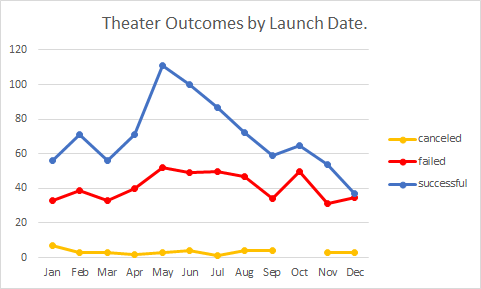
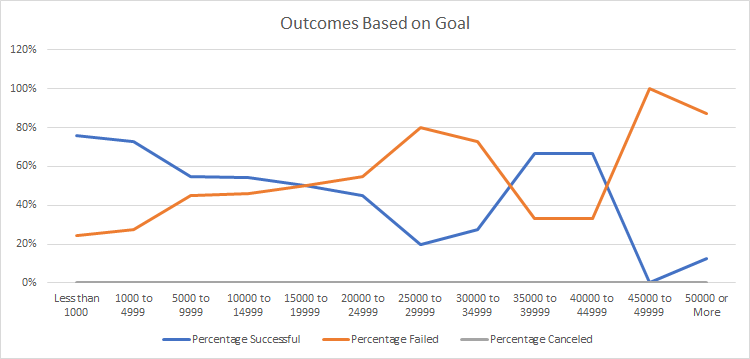

# Kickstarter_Challenge
visualizing campaign outcomes based on their launch dates and their funding goals
## Overview of the project:
The goal of this project is to know how different campaigns fared in relation to their launch dates and their funding goals. 
### Background:
Client's play "Fever" came close to its fundraising goal in a short amount of time. The client would like to see how other's in the theater category faired in meeting their goals. Doing so will help the client better perpare for future fund raiser endeavors.
## Analysis and Challenges:
### Theater Outcomes by Launch Date.

#### Analysis
The above graph represents the outcomes based on success, failed and canceled rate grouped by year. As you can see there is a spike successful funded plays during the months of May. The data would suggest that May would be a good month to begin a fund raising goal as it would have the greater chance to suceed. On the other hand October would not be a great month to fund raise as the graph shows it will most likely fail.
### Outcomes based on Goals

This graph represnts the outcomes of the how well the plays fair based on goal amounts. Goal amounts were arranged in increments or 5,000 with a minimum value less than 1,000 and a maximum value grater than 50,000. The outcome is shown as a percent of the success rate. As you can see the lower the goal amount leads to it have a greater chance of meeting its goal. Where the greater goal amount is less successful.
#### Challenges
Some possible challenges one could face is while analysising the data would be working with the deadlline and launch dates. those would need to be converted to a readable format before any analysis could begin. Also the Category filed would need to seperated into to a main category and a sub category. Once this is done simple analysis can begin.
## Results:
Based on the data one could conclude that fund raisers started in May would be more successful then once started in October. This is visualized in the Outcomes vs. Launch table. Also ther is a greater chance for the fund raiser to succeed the lower goal amounts.
